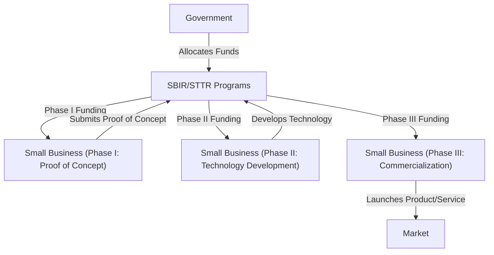
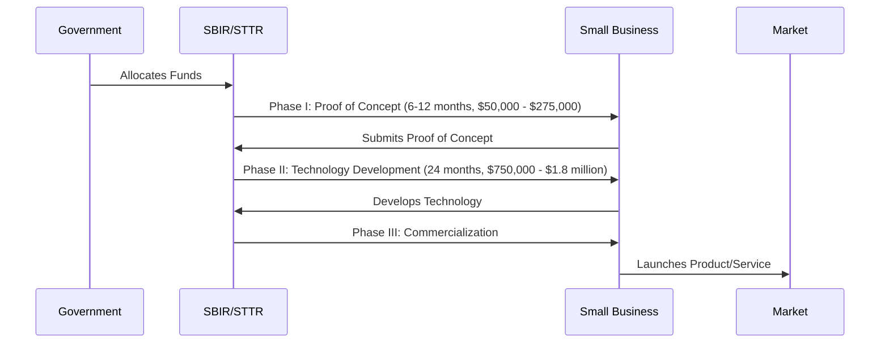

## SBIR Process Flow

```mermaid
graph TB
    Government["Government"] -->|Allocates Funds| SBIR["SBIR/STTR Programs"]
    SBIR -->|Phase I Funding| SmallBusiness1["Small Business (Phase I: Proof of Concept)"]
    SmallBusiness1 -->|Submits Proof of Concept| SBIR
    SBIR -->|Phase II Funding| SmallBusiness2["Small Business (Phase II: Technology Development)"]
    SmallBusiness2 -->|Develops Technology| SBIR
    SBIR -->|Phase III Funding| SmallBusiness3["Small Business (Phase III: Commercialization)"]
    SmallBusiness3 -->|Launches Product/Service| Market["Market"]
```
Second Diagram

```mermaid
sequenceDiagram
  participant Government
  participant SBIR/STTR
  participant Small Business
  Government->>SBIR/STTR: Allocates Funds
  SBIR/STTR->>Small Business: Phase I: Proof of Concept (6-12 months, $50,000 - $275,000)
  Small Business->>SBIR/STTR: Submits Proof of Concept
  SBIR/STTR->>Small Business: Phase II: Technology Development (24 months, $750,000 - $1.8 million)
  Small Business->>SBIR/STTR: Develops Technology
  SBIR/STTR->>Small Business: Phase III: Commercialization
  Small Business->>Market: Launches Product/Service
```