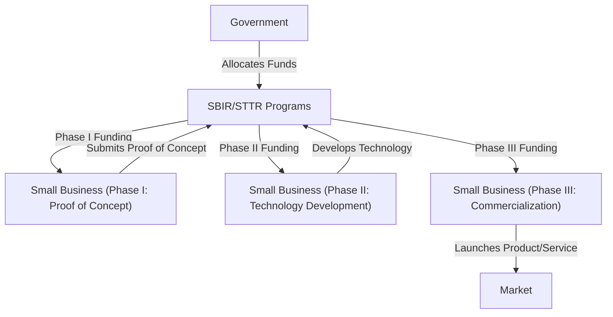
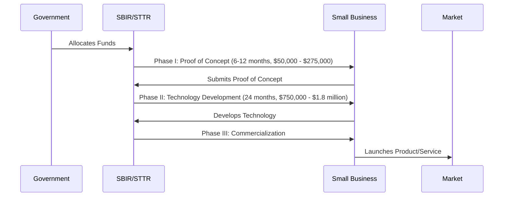

# SBIR
The SBIR and STTR programs fund a diverse portfolio of startups and small businesses across technology areas and markets to stimulate technological innovation, meet Federal research and development (R&D) needs, and increase commercialization to transition R&D into impact.

## [What is SBIR?](https://www.sbir.gov/about)

[**Overview Deck**](programs/sbir/SBA_SBIR_Overview_March2020.pdf)

## Who is Participating?
Glad you asked. The list is...dynamic, but these are the agencies we've confirmed.

- [Department of Homeland Security (DHS)](programs/sbir/agencies/dhs/README.md)
- [Department of Commerce (DoC)](programs/sbir/agencies/doc/nist/README.md)
    - [National Institute for Standards & Technology (NIST)](programs/sbir/agencies/doc/nist/README.md)
    - [National Oceanic & Atmospheric Association (NOAA](programs/sbir/agencies/doc/noaa/README.md)
- [Department of Defense (DoD)](programs/sbir/agencies/dod/README.md)
    - [Air Force](programs/sbir/agencies/dod/air-force/README.md)
    - [Army](programs/sbir/agencies/dod/army/README.md)
    - [Navy](programs/sbir/agencies/dod/navy/README.md)
- [Department of Energy (DoE)](programs/sbir/agencies/doe/README.md)
- [Department of Transportation (DoT)](programs/sbir/agencies/dot/README.md)
- [Department of Education (ED)](programs/sbir/agencies/ed/README.md)
- [Environmental Protection Agency (EPA)](programs/sbir/agencies/epa/README.md)
- [Department of Health and Human Services (HHS)](programs/sbir/agencies/hhs/README.md)
    - [Centers for Disease Control and Prevention (CDC)](programs/sbir/agencies/hhs/cdc/README.md)
    - [National Institutes of Health (NIH)](programs/sbir/agencies/hhs/nih/README.md)
- [National Aeronautics and Space Administration (NASA)](programs/sbir/agencies/nasa/README.md)
- [National Science Foundation (NSF)](programs/sbir/agencies/nsf/README.md)
- [United States Department of Agriculture (USDA)](programs/sbir/agencies/usda/README.md)

## What Type of Projects are Accepted?
Well, lots..and it depends. It's complicated. SBIR can be everything you want, or what the government wants.

Cool cool. I'm lost. [Show me some examples.](https://www.sbir.gov/news/success-stories)

## Other Questions
[**Who is SBIRing?**](https://www.sbir.gov/sbirsearch/firm/all)

## Phases? Explain.
The SBIR Program is structured in three phases:

### Phase I
 The objective of Phase I is to establish the technical merit, feasibility, and commercial potential of the proposed R/R&D efforts and to determine the quality of performance of the small business awardee organization prior to providing further Federal support in Phase II. SBIR/STTR Phase I awards are generally $50,000 - $250,000 for 6 months (SBIR) or 1 year (STTR).

### Phase II
The objective of Phase II is to continue the R/R&D efforts initiated in Phase I. Funding is based on the results achieved in Phase I and the scientific and technical merit and commercial potential of the project proposed in Phase II. Typically, only Phase I awardees are eligible for a Phase II award. SBIR/STTR Phase II awards are generally $750,000 for 2 years.

### Phase III
The objective of Phase III, where appropriate, is for the small business to pursue commercialization objectives resulting from the Phase I/II R/R&D activities. The SBIR/STTR programs do not fund Phase III. At some Federal agencies, Phase III may involve follow-on non-SBIR/STTR funded R&D or production contracts for products, processes or services intended for use by the U.S. Government.

